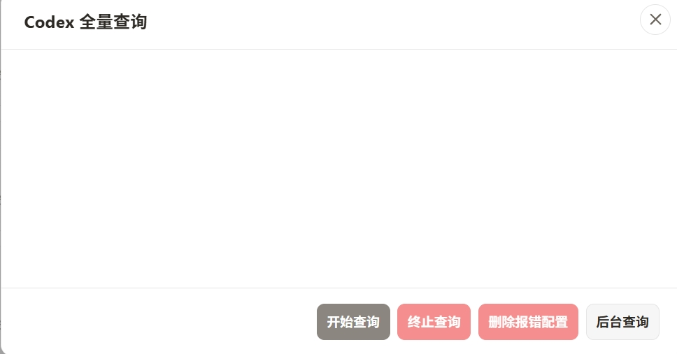

# CLI Proxy API 管理中心 (CPAMC)

> 一个基于官方仓库二次创作的 Web 管理界面

---

## 关于本项目

本项目是基于官方 [CLI Proxy API WebUI](https://github.com/router-for-me/Cli-Proxy-API-Management-Center) 进行开发的管理界面

### 与官方版本的区别

本版本与官方版本其他功能保持一致，主要差异在于**新增codex凭证一件查询和删除**，对vercel密钥的查看

### 界面预览

管理界面展示




---

## 快速开始

### 使用本管理界面

在你的 `config.yaml` 中修改以下配置：

```yaml
remote-management:
  panel-github-repository: "https://github.com/ouqiting/Cli-Proxy-API-Management-Center"
```

配置完成后，重启 CLI Proxy API 服务，访问 `http://<host>:<api_port>/management.html` 即可查看管理界面

详细配置说明请参考官方文档：https://help.router-for.me/cn/management/webui.html

---

## 主要功能

### codex一键配置 - 核心新增功能

这是本管理界面相对于官方版本的新增功能，提供了codex的一键查询，删除报错凭证的功能


---

## 官方版本功能

以下功能与官方版本一致，通过改进的界面提供更好的使用体验

### 仪表盘
- 连接状态实时监控
- 服务器版本和构建信息一目了然
- 使用数据快速概览，掌握全局
- 可用模型统计

### API 密钥管理
- 添加、编辑、删除 API 密钥
- 管理代理服务认证

### AI 提供商配置
- **Gemini**：API 密钥管理、排除模型、模型前缀
- **Claude**：API 密钥和配置、自定义模型列表
- **Codex**：完整配置管理（API 密钥、Base URL、代理）
- **Vertex**：模型映射配置
- **OpenAI 兼容**：多密钥管理、模型别名导入、连通性测试
- **Ampcode**：上游集成和模型映射

### 认证文件管理
- 上传、下载、删除 JSON 认证文件
- 支持多种提供商（Qwen、Gemini、Claude 等）
- 搜索、筛选、分页浏览
- 查看每个凭证支持的模型

### OAuth 登录
- 一键启动 OAuth 授权流程
- 支持 Codex、Anthropic、Gemini CLI、Qwen、iFlow 等
- 自动保存认证文件
- 支持远程浏览器回调提交

### 配额管理
- Antigravity 额度查询
- Codex 额度查询（5 小时、周限额、代码审查）
- Gemini CLI 额度查询
- 一键刷新所有额度

### 使用统计
- 请求/Token 趋势图表
- 按模型和 API 的详细统计
- RPM/TPM 实时速率
- 缓存和推理 Token 分解
- 成本估算（支持自定义价格）

### 配置管理
- 在线编辑 `config.yaml`
- YAML 语法高亮
- 搜索和导航
- 保存和重载配置

### 日志查看
- 实时日志流
- 搜索和过滤
- 自动刷新
- 下载错误日志
- 屏蔽管理端流量

### 中心信息
- 连接状态检查
- 版本更新检查
- 可用模型列表展示
- 快捷链接入口

---

## 连接说明

### API 地址格式

以下格式都可以，系统会自动识别

```
localhost:8317
http://192.168.1.10:8317
https://example.com:8317
```

### 管理密钥

管理密钥是验证管理操作的钥匙，和客户端使用的 API 密钥不一样

### 远程管理

从非本地浏览器访问的时候，需要在服务器启用远程管理（`allow-remote-management: true`）

---

## 界面特性

### 主题切换
- 亮色模式
- 暗色模式
- 跟随系统

### 语言支持
- 简体中文
- English

### 响应式设计
- 桌面端完整功能
- 移动端适配体验
- 侧边栏可折叠

---

## 常见问题

**Q: 如何使用这个自定义 UI？**

A: 在 CLI Proxy API 的配置文件中添加以下配置即可
```yaml
remote-management:
  panel-github-repository: "https://github.com/ouqiting/Cli-Proxy-API-Management-Center"
```

**Q: 无法连接到服务器？**

A: 请检查以下内容
- API 地址是否正确
- 管理密钥是否正确
- 服务器是否启动
- 远程访问是否启用

**Q: 日志页面不显示？**

A: 需要去"基础设置"里开启"日志记录到文件"功能

**Q: 某些功能显示"不支持"？**

A: 可能是服务器版本太旧，升级到最新版本的 CLI Proxy API

**Q: OpenAI 提供商测试失败？**

A: 测试是在浏览器端执行的，可能会受到 CORS 限制，失败不一定代表服务器端不能用


---

## 相关链接

- **官方主程序**: https://github.com/router-for-me/CLIProxyAPI
- **官方 WebUI**: https://github.com/router-for-me/Cli-Proxy-API-Management-Center
- **本仓库**: https://github.com/ouqiting/Cli-Proxy-API-Management-Center

## 许可证

MIT License
